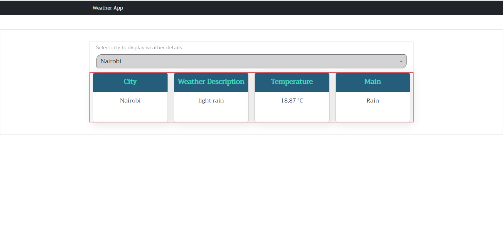

# Fetching Weather Data from OpenWeatherMap API

## Table of Contents

# Description

- we use the [OpenWeatherMap Api](https://openweathermap.org/api) to fetch weather data for a selected location in our Weather App.



# OpenWeatherMap API

- To get weather data, we use the [OpenWeatherMap](https://openweathermap.org/), a service providing various weather information using an API.

- The [OpenWeatherMap API](https://openweathermap.org/api) has the following endpoints:
  1. [Current weather data](https://openweathermap.org/current)
  2. [Hourly Forecasts](https://openweathermap.org/api/hourly-forecast)
  3. [History data](https://openweathermap.org/history)
  4. e.t.c.,

# Working with the OpenWeatherMap API

## Make HTTP Request

- In JavaScript, we can make HTTP requests using the built-in `fetch` function, which returns a **promise** that resolves to the response from the server.
- Example:

  ```js
  // Get Request
  const apiUrl =
    "https://api.openweathermap.org/data/2.5/weather?q=Nairobi&appid={API_KEY}"; //TODO: replace with your API key

  fetch(apiUrl)
    .then((response) => response.json())
    .then((data) => {
      console.log(data);
    })
    .catch((error) => {
      console.log("Error: ", error);
    });
  ```

- OR,

  ```js
  const apiKey = ""; // TODO: replace with your own key
  const apiUrl = `https://api.openweathermap.org/data/2.5/weather?q=Nairobi&appid=${apiKey}`;

  fetch(apiUrl)
    .then((response) => response.json())
    .then((data) => {
      console.log(data);
    })
    .catch((error) => {
      console.log("Error: ", error);
    });
  ```

- A single HTTP request returns this data:
  ```js
    {
    coord: { lon: -0.1257, lat: 51.5085 },
    weather: [
        {
        id: 802,
        main: 'Clouds',
        description: 'scattered clouds',
        icon: '03d'
        }
    ],
    base: 'stations',
    main: {
        temp: 282.51,
        feels_like: 279.36,
        temp_min: 281.4,
        temp_max: 283.59,
        pressure: 986,
        humidity: 83
    },
    visibility: 10000,
    wind: { speed: 6.69, deg: 230, gust: 11.83 },
    clouds: { all: 40 },
    dt: 1704026921,
    sys: {
        type: 2,
        id: 2075535,
        country: 'GB',
        sunrise: 1704009974,
        sunset: 1704038403
    },
    timezone: 0,
    id: 2643743,
    name: 'London',
    cod: 200
    }
  ```
- **Remarks**:
  - above code makes a `GET` request to the OpenWeatherMap API to get the current weather for **Nairobi**, using your API key
  - The `then` method of the **Promise** is used to handle the response. The first `.then` method calls `response.json()` to parse the response as `JSON`, and the second `.then` method logs the response data to the console.
  - The `.catch` method is used to handle any errors that occur during the request.

## Handle Response

- From the above sample output, we can parse the `JSON` data and extract specific information neeeded for our App.
- Examples:

  ```js
  // using OpenWeatherMap API.

  const apiKey = ""; // TODO: replace with your own key
  const apiUrl = `https://api.openweathermap.org/data/2.5/weather?q=Nairobi&appid=${apiKey}`;

  fetch(apiUrl)
    .then((response) => response.json())
    .then((data) => {
      //console.log(data); //TODO: uncomment this to get the whole response
      const temperature = data.main.temp;
      const humidity = data.main.humidity;
      const windSpeed = data.wind.speed;
      console.log(
        `Temperature: ${temperature}, Humidity: ${humidity}, Wind Speed: ${windSpeed}`
      ); // Output: Temperature: 298.69, Humidity: 44, Wind Speed: 5.51
    })
    .catch((error) => {
      console.log("Error: ", error);
    });
  ```

  - code parses the response data as `JSON` and extracts the **temperature**, **humidity**, and **wind speed **from the `main` and `wind objects` in the response. It then logs this information to the console.

## Handling Response - Using Response Information to Update an application UI

- Use the response to update our Weather App UI:

  ```js
  // Weather App
  import config from "./config.js";

  const selectCity = document.getElementById("selectCity");
  const iconImg = document.getElementById("weather-icon");
  const displayCity = document.getElementById("displayCity");
  const displayDescription = document.getElementById("displayDescription");
  const displayTemperature = document.getElementById("displayTemprature");
  const displayMain = document.getElementById("displayMain");

  const selectAndDisplayCity = () => {
    let selectedCity = selectCity.options[selectCity.selectedIndex].text;
    // log the selected city to the console if needed
    console.log("Selected City: " + selectedCity);

    //const apiKey = ""; //TODO:
    // or, using API key from config.js file
    const apiKey = config.apiKey;
    const apiUrl = `https://api.openweathermap.org/data/2.5/weather?q=${selectedCity}&appid=${apiKey}`;

    fetch(apiUrl)
      .then((response) => response.json())
      .then((data) => {
        //const icon = data.weather[0].icon;
        //const iconUrl = `http://openweathermap.org/img/wn/${icon}@2x.png`;
        //iconImg.src = iconUrl;
        displayCity.textContent = data.name;
        displayDescription.textContent = data.weather[0].description;
        displayTemperature.textContent =
          (data.main.temp - 273.15).toFixed(2) + " °C"; // Adjust units if needed
        displayMain.textContent = data.weather[0].main;
      })
      .catch((error) => {
        console.error("Error while fethcing weather data!", error);
      });
  };

  selectCity.addEventListener("change", selectAndDisplayCity);
  ```

- Here, we make a `GET` request to the **OpenWeatherMap API**, pass the API key as a parameter in the URL, and display the City, weather Description, Temperature and main on a webpage.

# Resources

1. [Hashnode - Working with APIs In Javascript](https://shreya-trivedi.hashnode.dev/working-with-apis-in-javascript)
